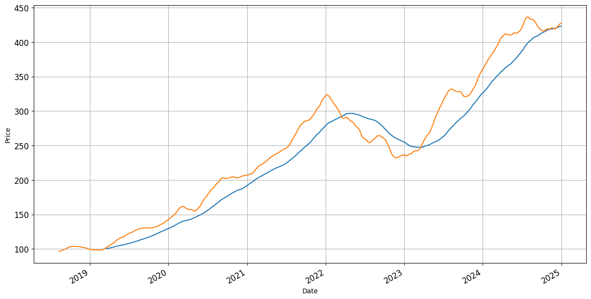

# Moving Average Crossover Strategy

## Overview

This project implements the Moving Average Crossover strategy for algorithmic trading. The strategy utilizes short-term and long-term moving averages to generate buy and sell signals for a given financial instrument.

## Features

- Implements Simple Moving Averages (SMA) and Exponential Moving Averages (EMA) for trading signals
- Backtesting on historical data
- Visualization of moving averages and trade signals
- Performance evaluation using key metrics

## Dataset

The strategy is tested on historical market data provided in `Data.csv`.

## Installation

1. Clone the repository:
   ```bash
   git clone https://github.com/yourusername/moving-average-crossover.git
   cd moving-average-crossover
   ```
2. Install dependencies:
   ```bash
   pip install -r requirements.txt
   ```

## Usage

Run the Jupyter Notebook to execute the strategy:

```bash
jupyter notebook code.ipynb
```

## Strategy Explanation

1. **Short-Term SMA**: Calculates a fast-moving average (e.g., 50-day SMA)
2. **Long-Term SMA**: Calculates a slow-moving average (e.g., 200-day SMA)
3. **Buy Signal**: When the short-term SMA crosses above the long-term SMA
4. **Sell Signal**: When the short-term SMA crosses below the long-term SMA

## Results & Visualization

### Close Price Graph


### Simple Moving Average (SMA) Signals


### SMA 50 vs SMA 200


### Exponential Moving Average (EMA) Signals


### EMA 50 vs EMA 200


### Returns Comparison


## Future Improvements

- Implementing more sophisticated trading strategies
- Adding risk management features
- Backtesting with different timeframes
- Enhancing performance evaluation

## Contributing

Contributions are welcome! Feel free to fork the repo, create a branch, and submit a pull request.

## License

This project is licensed under the MIT License.